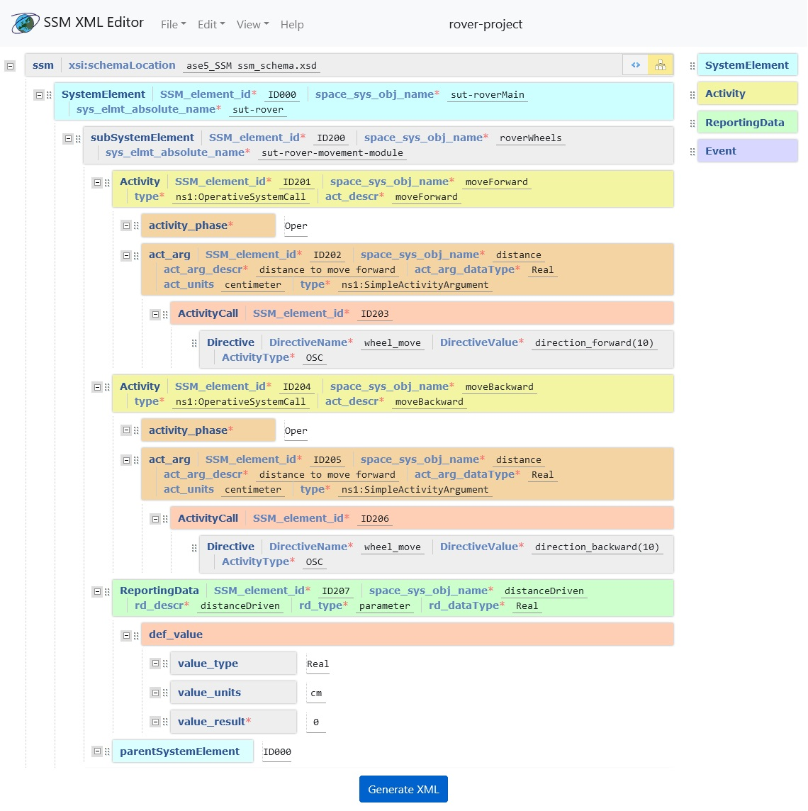

# XML-SSM-Editor [(Demo)](https://krkjack.github.io/XML-SSM-Editor/)
Web-based application for creating and editing XML files using System Space Model (SSM)

   

## Description (in Polish)
Opracowanie edytora umożliwiającego tworzenie modelu danych wykorzystywanych do komunikacji z systemem satelitarnym - SSM (Space System Model).

- Model jest zdefiniowany w formacie XML Schema (standard [ECSS-E-ST-70-31C](https://confluence-lesia.obspm.fr/download/attachments/3113613/ECSS-E-ST-70-31C%2831July2008%29.pdf?version=1&modificationDate=1494335253613&api=v2))
- Edytor powinien umożliwiać tworzenie elementów tego modelu takich jak Komponent (systemElement), Zdarzenie (Event), Działanie (Activity) i dane telemetryczne (reportingData) w sposób graficzny
- Edytor powinien tworzyć plik XML zgodny ze standardem
- Edytor powinien wizualizować tworzony plik w postaci graficznej np. diagram lub drzewo

## Installation (in Polish)
Aplikacja działa w dwóch kontenerach Docker dla:
- Edytora XML-SSM,
- Walidatora XML.

Walidator nie jest potrzebny do działania aplikacji. Służy jedynie do potwierdzenia poprawności stworzonego kodu XML przy próbie pobrania pliku .xml.

Do ich stworzenia można manualnie zbudować obrazy lub skorzystać z [Docker Compose](https://docs.docker.com/compose/).
### Docker Compose
1. Sklonuj repozytorium.
2. W katalogu głównym repozytorium wykonaj polecenie `docker-compose up --detach` w celu budowy obrazów i uruchomienia ich w postaci kontenerów.
3. Otwórz w przeglądarce adres http://localhost:8080 w celu sprawdzenia działania aplikacji.
### Docker (bez wykorzystania Docker Compose).
1. Sklonuj repozytorium.

Dla edytora SSM:

2. Przejdź do katalogu `ssm-editor`.
3. Wykonaj budowę obrazu za pomocą polecenia `docker build`, przykładowo: `docker build . --tag ssm-editor:latest`
4. Uruchom kontener za pomocą polecenia `docker run`, przykładowo: `docker run --name ssm-editor --publish 8080:80 --detach ssm-editor:latest`.

To samo dla walidatora XML:

2. Przejdź do katalogu `xsd-ssm-validator`.
3. Wykonaj budowę obrazu za pomocą polecenia `docker build`, przykładowo: `docker build . --tag ssm-validator:latest`
4. Uruchom kontener za pomocą polecenia `docker run`, przykładowo: `docker run --name ssm-editor --publish 9090:9090 --detach ssm-validator:latest`. 

W obu przypadkach należy pamiętać o wystawieniu portów za pomocą przełącznika `--publish`.

### Zmiana konfiguracji
Domyślnymi portami są:
- port `8080` dla edytora,
- port `9090` dla walidatora XML.

W celu zmiany ustawień portów należy edytować poszczególne pliki definicji obrazów `Dockerfile` (oraz ewentualnie `docker-compose.yml`).

**WAŻNE**: jeśli walidator XML będzie działał na innym adresie niż http://localhost:9090 należy edytować plik `ssm-editor/ssm-editor-web/js/scripts.js`, wskazując poprawny adres:
https://github.com/krkjack/XML-SSM-Editor/blob/1c4befd62d56bc9c3f98e9ad96ef5ff016bb0253/ssm-editor/ssm-editor-web/js/scripts.js#L84

## Third Party
- [Xonomy](https://github.com/michmech/xonomy)
- [XML validator](https://github.com/ISAITB/xml-validator)
